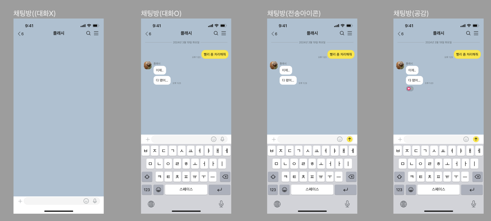

# 배포링크
[카카오톡](https://vercel.com/songess/ceos-week3-react-messenger)

# 후기 및 구현기능

생각보다 할 게 많았던 과제였던거 같습니다..!

디자이너분과 협업을 하면서 진행했기 떄문에 `styled-components`의 `theme`을 사용해 `font`, `textStyles`을 설정하고 시작했습니다. 또 375x812 맞춤으로 코드를 작성할 것이라 `rem`단위를 사용하지 않고 `px`을 사용했습니다.

절대경로를 설정했는데, cra를 사용한 프로젝트이기 때문에 `baseUrl`및 `paths`만으로는 설정이 부족했고 `craco`, `react-app-alias`의 라이브러리의 도움을 받아 해결했습니다. 다만 `@types`는 적용이 되지 않아 `type`들은 직접 선언해서 사용했습니다.

과제에 `recoil`사용이 권장되어 있어서 사용해봤습니다. `recoil`을 사용해보지 않았던 이유가 `redux`처럼 보일러 플레이트가 많고, 디스패치를 많이 사용해야 할 것 같아 사용해보지 않았으나, 직접 사용해보니 잘못된 생각이였다는 걸 깨달았습니다. `useRecoilState`를 `useState`처럼 사용할 수 있었고, 보일러 플레이트도 필요하지 않았습니다. 또한 `selector`를 통해 디스패치의 기능을 훨씬 쉽게 사용한 느낌이였습니다.  
공식문서를 찾아보니 `effects`를 통해 다른 `built-in`함수들도 많아 찾아보던 중 `onSet`과 `setSelf`는 유용하게 사용할 수 있을 거 같아 적용시켜 보았습니다.

`effects`는 '부수효과를 관리하고 atom을 초기화 또는 동기화하기 위한 API'라고 나와있어 `localStorage`에 제격이라 생각했습니다.
`setSelf`는 초기값을 설정하는 함수로, `localStorage`에 값이 있다면 받아오고, 없다면 저장해놓은 `json`데이터를 가져왔습니다.  
`onSet`은 atom을 모니터하며 값이 갱신되면 함수가 실행되어 `localStorage`를 최신화 시켰습니다.

이름을 눌렀을때 변하는 것을 구현하기 위해 `recoil`을 사용해 현재`user`가 누구인지를 토클시켜주었습니다.

정말 카카오톡처럼 구현해보고자 하니 어려운 부분이 두 개 있었습니다.

### 언제 상대방의 프로필과 이름을 띄우지?

상대방의 프로필과 이름이 항상 뜨면 안되고, 특정상황에만 떠야 했습니다.

- 처음 나한테 보냈다
- 이전 채팅이 상대방이 아니고 나다
- 날짜가 바뀌었다
  3가지 경우의 수 + 내가 아닌 경우에는 상대방의 프로필과 사진을 띄워줬습니다.

### 타임스탬프가 분 단위로 같을때는 가장 밑에 것만 찍히게 하고싶어

`chat`객체를 만들때 `isDisplay:boolean`속성을 넣었고 최초에 만들어질때는 `true`를 갖게 했습니다. 그리고 새로운 채팅이 입력될 때마다 이전 채팅을 확인하고 이전채팅과 새로운 채팅의 발신자가 같은지, 날짜 및 시간이 같은지 확인하여 모두 일치한다면 이전 채팅의 `isDisplay`를 `false`로 바꿔주었습니다.

```ts
interface Chat {
  chatId: string;
  to: string;
  from: string;
  content: string;
  date: string;
  time: string;
  isDisplay: boolean;
  isRead: boolean;
}

interface ChattingRoom {
  id: string;
  chat: Chat[];
}
```

확장성을 고려해 채팅관련된 것을 하나의 객체배열 안에서 해결하고자 하여 `ChattingRoom`이라는 객체를 배열로 만들어 관리했고, 채팅이 갱신되면 `ChattingRoom`의 속성 중 하나인 `Chat[]`의 마지막 원소에 접근하고 새로운 원소를 추가해줘야 했습니다.

리액트는 상태의 불변성을 중요시 여기는데, 이렇게 중첩된 구조의 배열에 접근하여 값을 바꿔주어야 하다보니 `prev`의 값을 받아와 새로운 변수에 할당하고 이를 다시 넣어줘야하는 과정을 반복해야 했기 때문에 로직이 조금 복잡해졌습니다. 더 나은 방법을 고민해봤지만 떠오르지 않아 이렇게 해결했습니다.

날짜가 변경될 때도 날짜 변경선이 나오도록 구현했습니다.

카카오톡에서처럼 상단 navigation이 반투명하게 설정했습니다.

`useDoubleClick`훅을 만들어 상대방 채팅을 더블클릭하면 좋아요를 표시할 수 있도록 했습니다.

# Key Questions

## JavaScript를 사용할때에 비해 TypeScript를 사용할 때의 장점은 무엇인가요?

자동완성기능을 사용할 수 있고, 에러를 사전에 방지할 수 있습니다.

js는 유연한 언어인만큼 어떻게 작동할 지 모르는 부분들이 있습니다.

```javascript
[] + [] = ''
[] + {} = '[object object]'
{} + [] = 0
{} + {} = NaN
```

이렇게 원하지 않는 형태로 동작할 수 있습니다. 이처럼 예상치 못한 연산으로 에러가 발생하면 컴파일 에러를 띄워주지 않고 런타임에 에러를 띄웁니다. 타입스크립트는 이런 부분을 사전에 방지해줄 수 있습니다.

컴포넌트들이 많아지고 주고받는 props들이 생기거나 컴포넌트를 선언할 때 어떤 props가 필요한지 헷갈릴 수 있는데, 자동완성기능을 통해 어떤 속성들이 필요한지 알 수 있습니다.

타입을 너무 제한적으로 사용한다고 느낄 수도 있겠지만, 유니온타입이나 제네릭을 통해 타입을 확장성있게 사용할 수도 있습니다.

## 디자이너로부터 전달받은 피그마 링크 혹은, 피그마 캡처본



## 컴포넌트를 분리한 기준은 무엇인가요?

채팅 박스역할을 하는 코드들, 채팅의 상단바역할을 하는 코드들, 하단바 역할을 하는 코드들 처럼 기능에 따라 분류 했습니다.

```
src
 ┣ assets
 ┃ ┣ data
 ┃ ┃ ┗ chattingRoomData.json
 ┃ ┣ img
 ┃ ┃ ┗ ...
 ┃ ┣ svg
 ┃ ┃ ┣ ...
 ┣ hooks
 ┃ ┗ useDoubleClick.tsx
 ┣ pages
 ┃ ┗ ChattingRoomPage
 ┃ ┃ ┣ components
 ┃ ┃ ┃ ┣ ChatBottom.tsx
 ┃ ┃ ┃ ┣ ChatHead.tsx
 ┃ ┃ ┃ ┣ Chatting.tsx
 ┃ ┃ ┃ ┣ HeartBox.tsx
 ┃ ┃ ┃ ┣ Mychat.tsx
 ┃ ┃ ┃ ┣ OppoChangeChat.tsx
 ┃ ┃ ┃ ┗ OppoChat.tsx
 ┃ ┃ ┗ ChattingRoomPage.tsx
 ┣ recoil
 ┃ ┣ chatAtom.ts
 ┃ ┗ userAtom.ts
 ┣ styles
 ┃ ┣ GlobalStyle.ts
 ┃ ┗ theme.ts
 ┣ types
 ┃ ┗ type.ts
 ┣ App.tsx
 ┣ index.tsx
 ┣ svg.d.ts
 ┗ types.d.ts
```

페이지폴더를 만들고, 컴포넌트 폴더를 만들어서 페이지에서 사용하는 컴포넌트들을 만들어줬습니다. 기능별로 컴포넌트들을 구현했기 때문에 원하는 위치에서 컴포넌트를 호출해주고 css만 설정해주면 페이지를 만들 수 있었습니다.

## 디자인 시스템을 적용하면서 느낀 점은 무엇인가요?

혼자 만들다 보면 색상이나 텍스트스타일을 미리 지정해놓는게 아니기 때문에 한번 해보고 렌더링 해보면서 어떤게 제일 적합한지 여러번 시도해봐야 했습니다. 하지만 `figma`를 통해 디자인을 받아서 개발했기 때문에 그런 고민을 할 필요가 없었습니다.

또한 이미 정해진 규격(ex. body1, body2, body3, ...)이 있고 그것들을 사용해 디자인을 해주셨기 때문에, 미리 `theme`으로 규격을 저장해놓으면 개발하면서 호출하기만 하면 되니깐 굉장히 편했습니다.


## 디자이너와 소통하며 느낀점은 무엇인가요?

기능적인 부분을 위주로 생각하다보니 디자인적 요소를 가끔 잘못 만들 때가 있습니다. 버튼이 의도한게 아니거나, 간격이 이상하거나 하는 부분들을 놓쳐서 배포했는데 이런 부분들을 피드백 해주셔서 나는 개발하는 부분에 더 집중하면 돼서 좋다! 라고 느꼈습니다. 

또한 디자이너와 개발자의 시선이 다르기 때문에 원활한 소통을 통해 프로젝트를 끝내면 훨씬 더 멋진 결과물의 나올 거 같다고 생각했습니다.